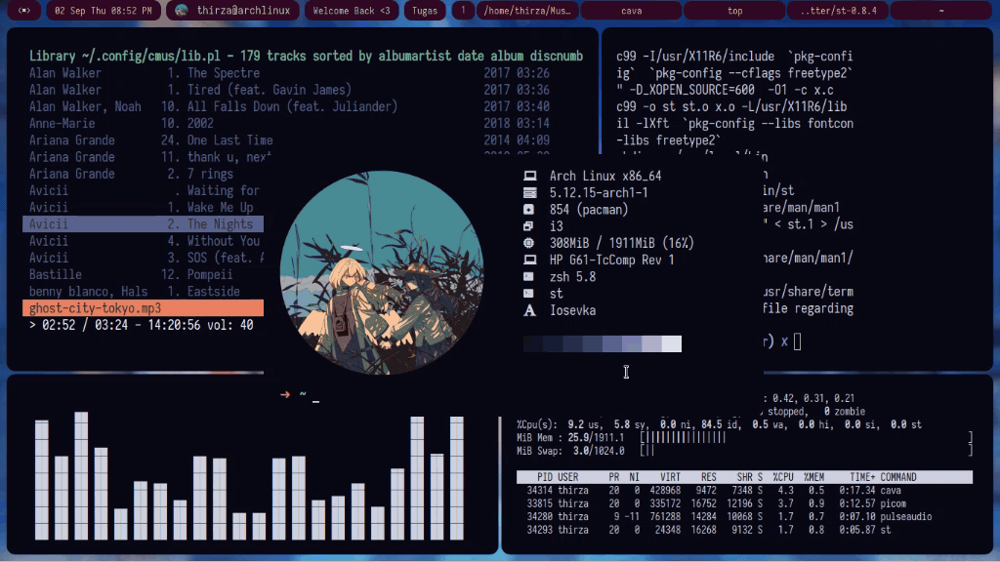
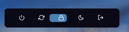
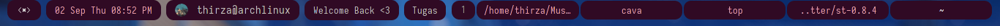
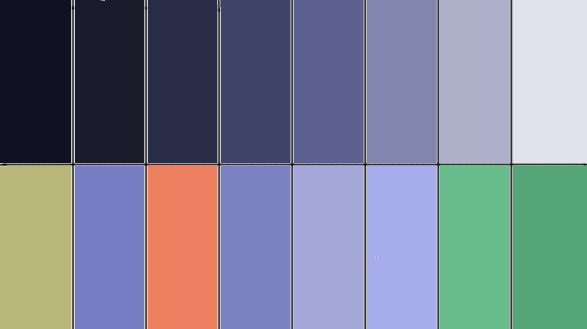
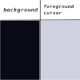
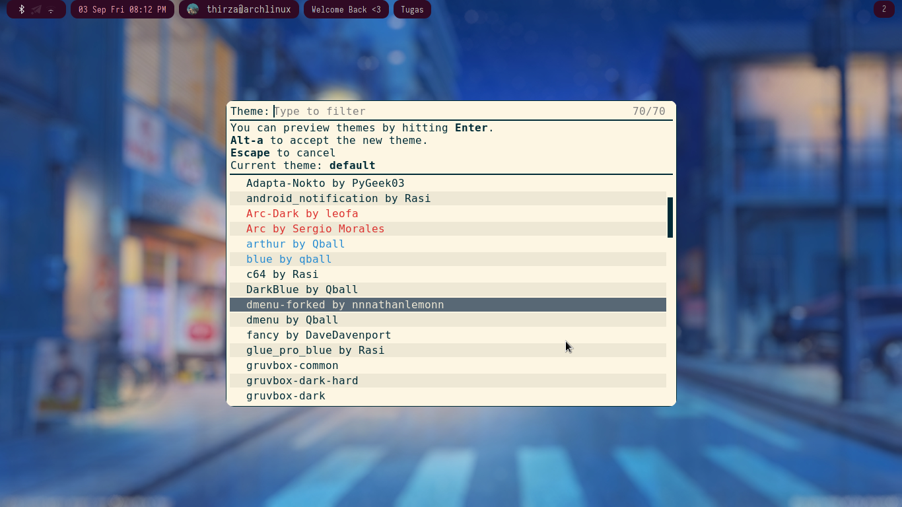

# Tokyo Night Dotfiles
## description:
> a simple dark theme rice configuration for *nix

- clone this repository

```
https://github.com/nnnathanlemonnn/tokyo-night-dotfiles.git
```
## visuals

### what's on the preview?
#### rofi 
> A window switcher, application launcher and dmenu replacement
> Custom Rofi theme.. based on: 
##### Qball's dmenu rofi theme
> 
##### adi1090x powermenu
> 
#### tint2
> Basic, good-looking task manager for WMs
>-	 Custom made tint2 bar
 	 
#### cava 
>Console visualizer
#### cmus
>Feature-rich ncurses-based music player
#### top
> task manager
#### picom rounded
> X Compositor (a fork of xcompmgr-dana) (with rounded corners patch)
#### Suckless Simple Terminal
> build from source terminal emulator, perfect for customization
> "but I don't use/like st.." no problem I have the color palette!
> 
> 
#### Neofetch 
> A CLI system information tool written in BASH that supports displaying images.
#### i3-gaps
>A fork of i3wm tiling window manager with more features, including gaps

## installation
### get :
- neofetch

``` bash
# arch based
$ sudo pacman -S neofetch

# ubuntu/debian based
$ sudo apt-get install neofetch

```

- tint2

``` bash
# arch based
$ sudo pacman -S tint2

# ubuntu based
$ sudo apt install tint2

```

- cava

``` bash
https://github.com/karlstav/cava.git
```

- cmus

``` bash
# arch based
$ sudo pacman -S cmus

#Ubuntu based
$ sudo apt-get install cmus
```

- picom rounded

```
https://github.com/sdhand/picom
```

- rofi 

```
https://github.com/davatorium/rofi
```

#### install
- rofi

``` config
# make a shortcut first
# for example  i3

bindsym $mod+d exec --no-startup-id rofi -show run
```
> now move/copy the file 'dmenu-forked.rasi' from this repo to 

 ```/usr/share/rofi/themes```


> then open rofi with your shortcut that you have made (mine is win/$mod + d)

> now type 'rofi-theme-selector' 


> select the theme 'dmenu-forked by nnnathanlemonnn'

- rofi powermenu

> clone adi1090x's repo ```https://github.com/adi1090x/rofi.git``` and install it
on your machine, after that, go to ```.config/rofi/powermenu```.

> move/copy 'dmenu-forked-powermenu.rasi' from this repo to ```.config/rofi/powermenu```

> configure the ```powermenu.sh``` script 

```bash
#change the theme, 
theme="dmenu-forked-powermenu"
```

> 
n
  

## note

## project status


## links

- [adi1090x rofi theme](https://github.com/adi1090x/rofi.git)
- [cava console visualizer](https://github.com/karlstav/cava.git)


